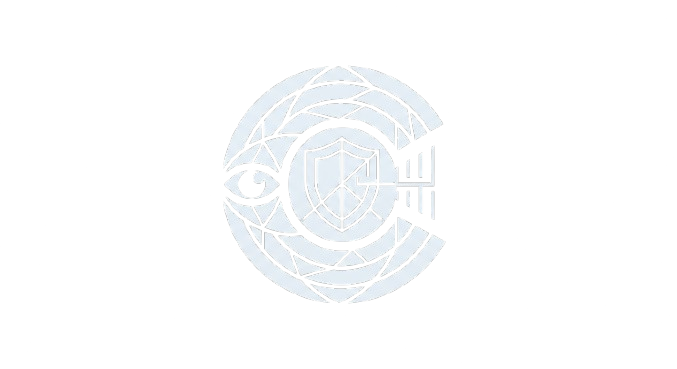

<div align="center">
  
  <h1>CLARION</h1>
  <p><b>AI-Powered Threat Intelligence & Digital Public Safety Platform</b></p>
  <p>Defeating Counterfeiting, Fraud & Digital Arrest Scams</p>

  [](https://opensource.org/licenses/MIT)
  [](https://reactjs.org/)
  [](https://fastapi.tiangolo.com/)
  [](https://tailwindcss.com/)
</div>

<br />

CLARION is a comprehensive, three-tier AI platform designed to put enterprise-grade fraud detection directly into the hands of Indian citizens. It operates completely free of charge, supports 6 regional languages, and features a dual-mode architecture capable of running fully offline on local hardware or via cloud fallbacks.

---

## 🛡️ Core Components

| Component | What It Does | Technology Stack |
|:---|:---|:---|
| **ScanShield** | Detects counterfeit ₹500 and ₹2000 currency notes via live camera feed or uploaded images. | **EfficientNet-B0** (CV) + OpenCV |
| **ScamRadar** | Classifies suspicious texts and digital arrest scam descriptions against 8 known fraud patterns. | **DistilBERT** (NLP) + TF-IDF |
| **FraudBot** | A multilingual conversational fraud risk assessor that conducts structured risk evaluations. | **Mistral-7B** (Local LLM via Ollama) / **Groq Cloud** API |

---

## ⚡ Dual-Mode Architecture

CLARION is designed to run seamlessly regardless of your hardware capabilities. It employs a smart fallback system for all its models:

- **AI Mode (Enterprise)**: Utilizes deep learning models (EfficientNet, DistilBERT, Mistral-7B). Requires GPU/high-CPU for local inference or a Groq API key.
- **Offline / Fallback Mode**: If the heavy AI models are missing, CLARION gracefully degrades to highly optimized heuristics (OpenCV edge detection, TF-IDF NLP classification, and Rule-based assessment) ensuring the platform never breaks during a live demo.

---

## 🚀 Complete Setup Guide

### Prerequisites
- Python 3.10+
- Node.js 18+
- Git

### 1. Clone the Repository
```bash
git clone https://github.com/AS24xADITYA/CLARION.git
cd CLARION
```

### 2. Backend Setup
The backend is powered by FastAPI and handles all the AI inference and intelligence routing.

```bash
# Create and activate a virtual environment
python -m venv venv

# Windows
venv\Scripts\activate
# Mac/Linux
source venv/bin/activate

# Install dependencies
cd backend
pip install -r requirements.txt

# Setup environment variables
copy .env.example .env
```

**Configuring the LLM (FraudBot)**
Open the `backend/.env` file. You have two options for the LLM:
1. **Local (Ollama)**: Leave as default if you have Ollama installed locally.
2. **Cloud (Groq - Recommended for easy setup)**: Get a free API key from [console.groq.com](https://console.groq.com) and add it to `.env`:
   ```env
   GROQ_API_KEY=gsk_your_key_here
   ```

**Start the Backend Server**
```bash
uvicorn main:app --host 0.0.0.0 --port 8000 --reload
```
*API Documentation is automatically available at: http://localhost:8000/docs*

### 3. Frontend Setup
The frontend is a modern React application utilizing Tailwind CSS and a dynamic Light/Dark mode design system.

```bash
# Open a new terminal window
cd frontend

# Install packages
npm install

# Start the development server
npm run dev
```
*The application will be live at: http://localhost:5173*

---

## 🧠 Upgrading to Real AI Models

Out of the box, CLARION will use its offline fallback modes. To upgrade the platform to use the real Machine Learning models, you have two options:

### Option A: Download Pre-trained Models (Fastest)
If you just want to run the platform immediately, you can download our pre-trained models from Google Drive:
1. **Download ScanShield Model**: [https://drive.google.com/file/d/1MoFufKtwuTmgdlBh4nZzujZ3W4Mw28da/view?usp=sharing]
2. **Download ScamRadar Model**: [https://drive.google.com/file/d/1MrAOSv4Uu9eNRUP99tp-6c2haqWpK2Ax/view?usp=sharing]
3. Place `scan_efficientnet.h5` in `backend/saved_models/`
4. Extract `scam_distilbert.zip` into `backend/saved_models/scam_distilbert/`

### Option B: Train from Scratch (Colab)
If you want to train the models yourself:

#### ScanShield (Computer Vision)
1. Navigate to `docs/colab/ScanShield_Training.ipynb` and open it in Google Colab.
2. Upload 20+ genuine and fake ₹500/₹2000 note images.
3. Run all cells to train the EfficientNet model (takes ~20 minutes on a T4 GPU).
4. Download the generated `scan_efficientnet.h5` file.
5. Place it exactly at: `backend/saved_models/scan_efficientnet.h5`
6. Restart the backend. You will see `[ScanShield] Loaded EfficientNet model` in the terminal logs.

### ScamRadar (NLP Classifier)
1. Navigate to `docs/colab/ScamRadar_Training.ipynb` and open it in Google Colab.
2. Run all cells (the training dataset of 1,350+ labeled samples is already included in the repo).
3. Download the generated `scam_distilbert.zip`.
4. Extract the contents directly into: `backend/saved_models/scam_distilbert/`
5. Restart the backend. You will see `[ScamRadar] Loaded DistilBERT model` in the terminal logs.

---

## 📂 Project Structure

```text
CLARION/
├── backend/
│   ├── api/                   # FastAPI route handlers
│   ├── models/                # AI model wrappers & logic
│   ├── data/                  # Scam patterns & training datasets
│   ├── db/                    # SQLite database config
│   ├── saved_models/          # Directory for .h5 and transformer weights
│   ├── main.py                # Backend entry point
│   └── requirements.txt
├── frontend/
│   ├── public/                # Logos and static assets
│   ├── src/
│   │   ├── components/        # Reusable React UI components
│   │   ├── contexts/          # Theme context (Light/Dark mode)
│   │   ├── pages/             # Main application views
│   │   └── services/          # API integration layer
│   ├── tailwind.config.js     # CSS variables & design system
│   └── package.json
└── docs/                      # Colab notebooks for model training
```

---

## 🔒 Security & Privacy
- **Zero Data Retention**: CLARION does not log user queries, scanned images, or chat transcripts. Session state is stored entirely in memory and cleared on exit.
- **Environment Safety**: API keys and environment configurations are strictly git-ignored to prevent credential leaks.
- **Offline Capable**: The platform is built to execute locally on edge hardware, ensuring absolute data sovereignty for sensitive public safety tasks.

---

## 🚨 Emergency Resources
If you suspect you are an immediate victim of digital fraud in India:
- **National Cyber Helpline**: Dial **1930** (Toll-free, 24×7)
- **Official Reporting Portal**: [cybercrime.gov.in](https://cybercrime.gov.in)

---

<div align="center">
  <i>All technology is 100% open source. Build it. Demo it. Deploy it. Protect the public.</i>
</div>
